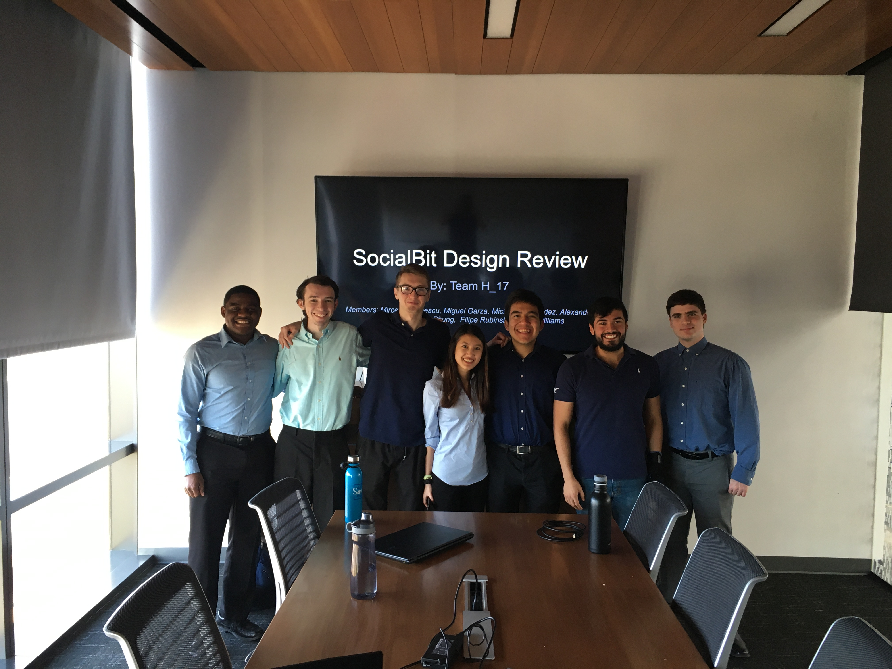
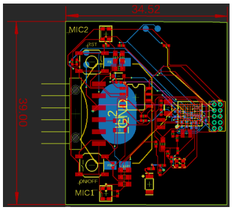

# Senior_Design_Project

In this repository, you will find our 2019-2020 Senior Design project. Additionally, there are attached pictures with embedded videos, so, please feel free to explore and enjoy the work done by our team. Email garzarobm@utexas.edu for more information on testing, how the project was created, current transformation and/or anything at all!

The structure of this repository is as follows (updated June 24, 2020)

  

###### AndroidApp
	- This folder contains starter android applications that the software team used to create at the beggining of the semester. 
	- Now (April 1st, 2020), we hope to make adjustments based off how our microcontroller uses bluetooth
	- Several android studio projects lie here
###### STL
	- Basic encasings for our wearable watch. 3D printed STL files
###### ambiqMicro/AmbiqSuite-Rel2.2.0
	- This contains the source code of the ambiq Micro with projects from other places.
###### TensorFlow
	- Using the source code given from tensorflow, the machine learning team created this folder
	- Allows interfacing with tensorflow models on embedded systems. 

# Common misconceptions
	1. As you see the video and think of what we came up with, one of the most common remarks and misconceptions with our device is that it seems very privacy-invading. All inference is done on the board and none of the data is actually stored. Once the inference has been made, the device sends the information through bluetooth, a exceptionally secure protocol, and again, never captured on the board. With this design, we could not keep your information even if we tried!

